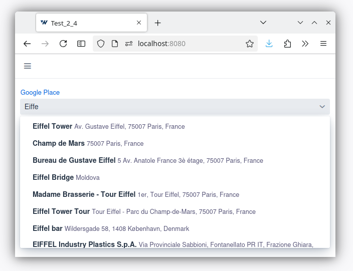
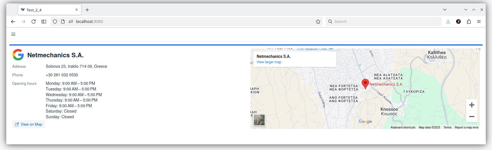
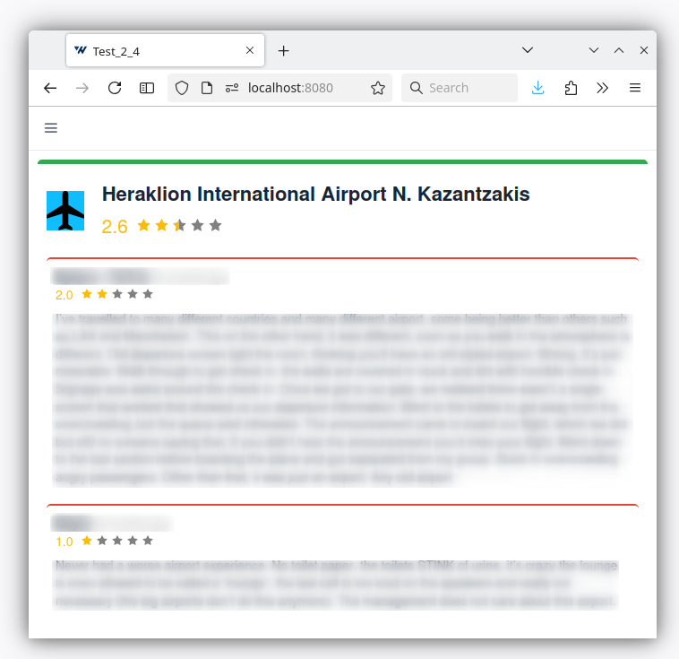

= Google Place add-on for Jmix

image::https://img.shields.io/badge/license-Apache%20License%202.0-blue.svg?style=flat[license,link=http://www.apache.org/licenses/LICENSE-2.0,window=_blank,opts=nofollow]

This add-on provides

* A custom datatype of a Google Place
* A related field to pick a Google Place
* Two fragments
** One to display rating and reviews of a Google Place
** One to display information about a Google Place

== Installation

The following table shows which version of the add-on is compatible with which version of the platform:

[options="autowidth,header"]
|===
|Jmix Version|Add-on Version|Implementation
|2.4.4|1.0.0|gr.netmechanics.jmix:jmix-google-place-starter:1.0.0
|===

For manual installation, add the following dependencies to your `build.gradle`:

[,gradle]
----
implementation 'gr.netmechanics.jmix:jmix-google-place-starter:<addon-version>'
----

== Requirements

apikey with map embeded and places api
