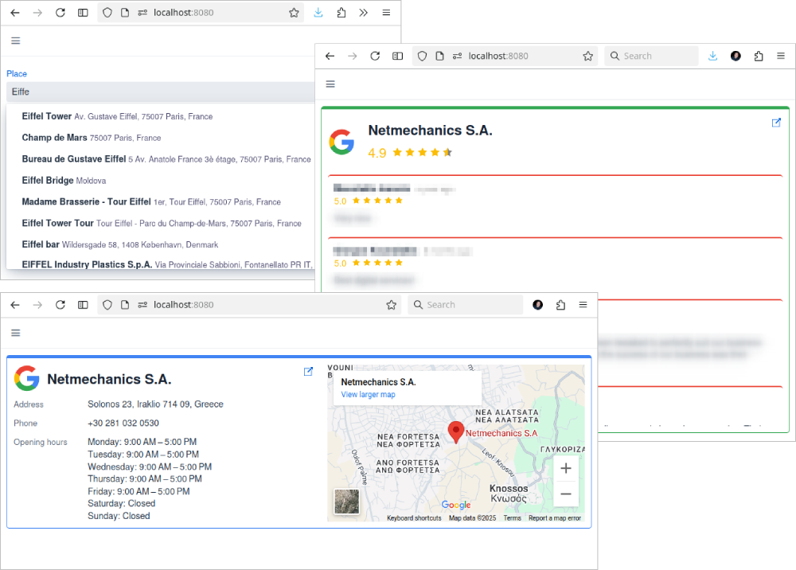
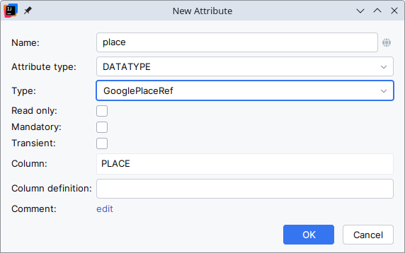
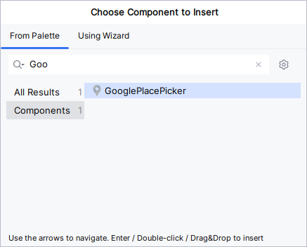
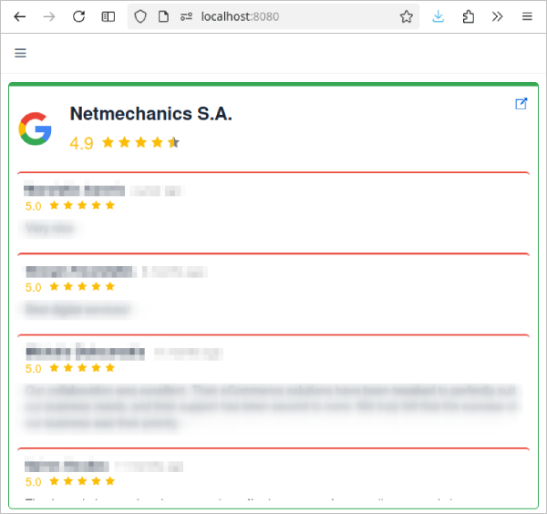
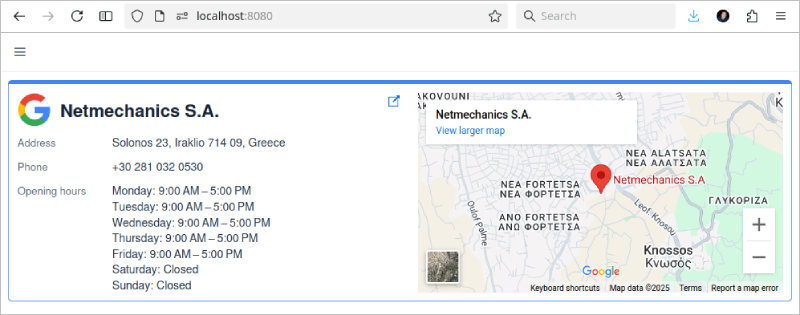

image::https://img.shields.io/badge/license-Apache%20License%202.0-blue.svg?style=flat[license,link=http://www.apache.org/licenses/LICENSE-2.0,window=_blank,opts=nofollow]

= Google Place add-on for Jmix

This add-on provides:

* A custom data type for representing a Google Place.
* A related field that allows users to select a Google Place.
* Two predefined fragments:
** A fragment for displaying the rating and user reviews of a Google Place.
** A fragment for presenting detailed information about a Google Place.

== Installation

The following table shows which version of the add-on is compatible with which version of the platform:

[options="autowidth,header"]
|===
|Jmix Version|Add-on Version|Implementation
|2.4.4|1.0.0|gr.netmechanics.jmix:jmix-google-place-starter:1.0.0
|===

For manual installation, add the following dependencies to your `build.gradle`:

[,gradle]
----
implementation 'gr.netmechanics.jmix:jmix-google-place-starter:<addon-version>'
----

== Configuration

There are two settings to specify.

[options="header,autowidth",cols=",^,^,"]
|===
|Setting|Type|Default Value|Description
|jmix.gplace.apiKey|Required||Google API key.
|jmix.gplace.languageCode|Optional|en|The language in which to return results and for map UI elements and tile labels.
|===

By default, you can define those settings in `application.properties` file.

Alternatively, implement a Spring bean of type `gr.netmechanics.jmix.gplace.GPlacePropertiesProvider` to provide these settings (e.g. to use https://www.jmix.io/marketplace/application-settings/[Jmix Application Settings,window=_blank] add-on).

[NOTE]
====
The add-on uses Google's https://developers.google.com/maps/documentation/places/web-service/op-overview[Places API (New),window=_blank] and the https://developers.google.com/maps/documentation/embed/embedding-map[Maps Embed API,window=_blank] (optional).

The Google API key must support the `Places API (New)`. Additionally, if you intend to use the xref:google-place-info-fragment[], the key must also support the `Maps Embed API`.
====

== How to use the add-on

=== Datatype

Add-on provides a new datatype `GooglePlaceRef`.

You can define an entity attribute with the `GooglePlaceRef` datatype using Studio.

As a result, Studio generates the following attribute definition:

[,java]
----
@Column(name = "PLACE")
private GooglePlaceRef place;
----

[NOTE]
====
The actual value stored in the database is a JSON string.

{"id":"ChIJ______tbmhQR0q7gENr8mSs","displayName":"Heraklion International Airport N. Kazantzakis","address":"Heraklion 716 01, Greece","latitude":35.3395461,"longitude":25.1760645}
====

=== Field

In a detail view you can add the field from studio `Component Palette` window

or through code

[,xml]
----
<view xmlns="http://jmix.io/schema/flowui/view"
        xmlns:nm="http://schemas.netmechanics.gr/jmix/ui"
        focusComponent="form">
    ...
    <layout>
        <formLayout id="form">
            <nm:googlePlacePicker id="placeField" property="place"/>
        </formLayout>
        ...
    </layout>
</view>
----

=== Fragments

==== Google Place Rating Fragment

A fragment for displaying the rating and user reviews of a Google Place.

===== Usage

[,xml]
----
<fragment class="gr.netmechanics.jmix.gplace.component.GooglePlaceRatingFragment">
    <properties>
        <property name="placeId" value="ChIJbVXA_SNamhQRGtyjFLUFH9E"/>
    </properties>
</fragment>
----

===== Properties

[options="header,autowidth",cols=",^,^,"]
|===
|Property|Type|Default Value|Description
|placeId|Required||The place ID for which to display rating and user reviews.
|apiKey|Optional|<config>|Google API key. If not specified, the key from the configuration will be used.
|languageCode|Optional|<config>|Specifies the language for UI elements and map tile labels. If not specified, the key from the configuration will be used.
|useGoogleIcon|Optional|true|Specifies whether to use the Google icon. If not, the https://developers.google.com/maps/documentation/places/web-service/icons#place-icon-and-background-color-requests[place icon,window=_blank] provided by the Google Places Service will be used.
|hideReviews|Optional|false|Specifies whether the reviews will be hidden.
|===

[[google-place-info-fragment]]
==== Google Place Info Fragment

A fragment for presenting detailed information about a Google Place.

===== Usage

[,xml]
----
<fragment class="gr.netmechanics.jmix.gplace.component.GooglePlaceInfoFragment">
    <properties>
        <property name="placeId" value="ChIJbVXA_SNamhQRGtyjFLUFH9E"/>
    </properties>
</fragment>
----

===== Properties

[options="header,autowidth",cols=",,,a"]
|===
|Property|Type|Default Value|Description
|placeId|Required||The place ID for which to display detailed information.
|apiKey|Optional|<config>|Google API key. If not specified, the key from the configuration will be used.
|languageCode|Optional|<config>|Specifies the language for map UI elements and tile labels. If not specified, the key from the configuration will be used.
|useGoogleIcon|Optional|true|Specifies whether to use the Google icon. If not, the https://developers.google.com/maps/documentation/places/web-service/icons#place-icon-and-background-color-requests[place icon,window=_blank] provided by the Google Places Service will be used.
|hideMap|Optional|false|Specifies whether the map will be hidden.
|hideOpeningHours|Optional|false|Specifies whether the opening hours information will be hidden.
|zoom|Optional|14|Initial zoom level of the map.
|mapType|Optional|roadmap|Specifies the type of map tiles to load. +
*roadmap* or *satellite*
|===

== Cache Cleaning Scheduler

The add-on caches requests to Google's APIs. It includes a built-in cleaning Quartz job, which is disabled by default. You can use it for periodic cache cleaning, as described below.

=== Quartz Configuration

To use the configuration of the Quartz job for cache cleaning, do the following:

. Include Quartz add-on in your project as described in the https://docs.jmix.io/jmix/quartz/index.html#installation[Quartz / Installation,window=_blank].

. Set the *jmix.gplace.use-default-cleaning-cache-quartz-configuration* property to true:
+
[source, properties,indent=0]
----
jmix.gplace.use-default-cleaning-cache-quartz-configuration=true
----

. Change the CRON expression if necessary using the *jmix.gplace.cleaning-cache-cron* property.
+
[source, properties,indent=0]
----
jmix.gplace.cleaning-cache-cron=0 0 1 1 1/1 ? *
----